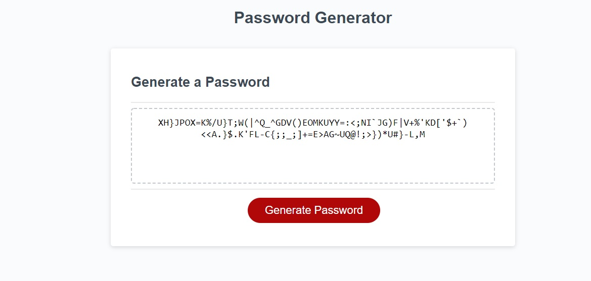
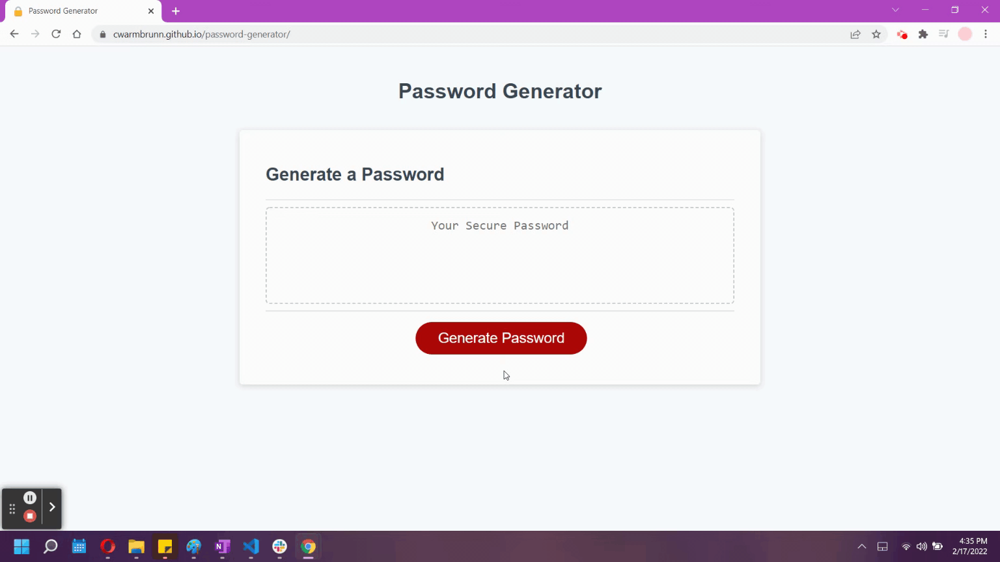

**Project Title:**

Password Generator

---

**Project Description/Summary:**

Creating a password generator application that an employee can use to generate a random password matching selected criteria ( 8 - 128 characters) and at least one password type used (upper or lowercase letters, numbers, or special characters).

---

**Live Site:**

Head over to https://cwarmbrunn.github.io/password-generator/ to view the page live!

---

**Technology Used:**

- JavaScript
- HTML
- CSS

---

**Installation:**

You can clone this repo - no special instructions to load this!

---

**Screenshots/GIF:**

